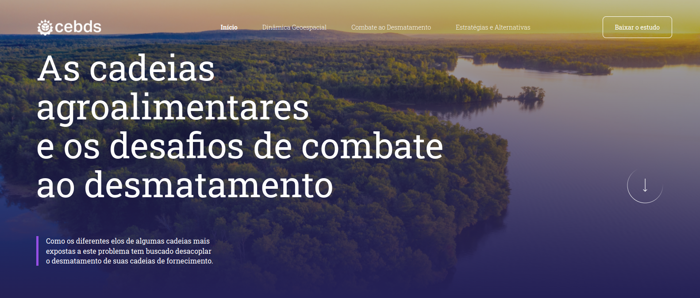

## 🔖&nbsp; Sobre

Trabalho de freelancer realizado para a empresa CEBDS com intuito de criar um relatorio interativo de um estudo produzido. Baseado em um projeto produzido e entregue via Figma.

## :zap: Tecnologias utilizadas

O projeto foi desenvolvido utilizando as seguintes tecnologias

- HTML
- CSS
- Javascript
